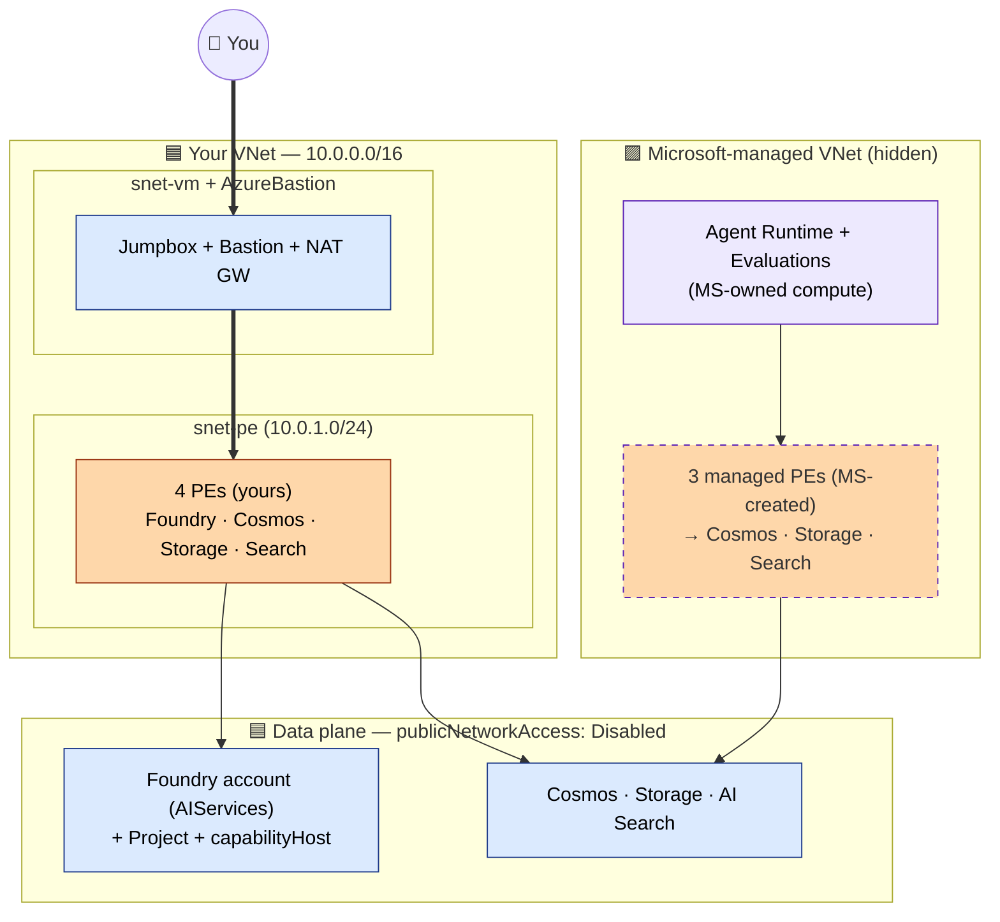
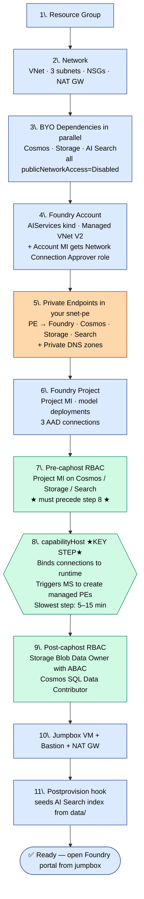
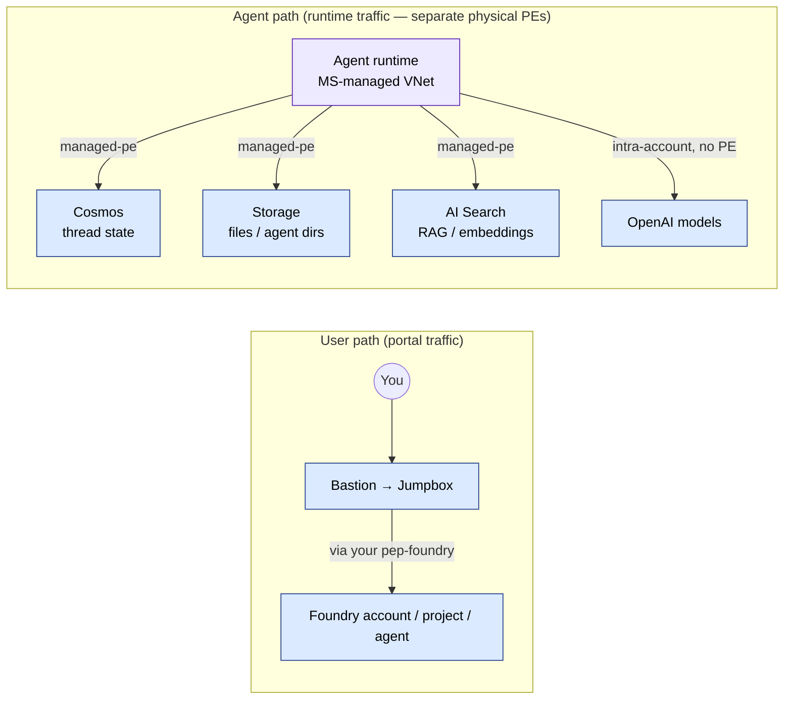

# Foundry Private Networking — Managed VNet flavor

End-to-end private-networking reference for **Azure AI Foundry Agents** (Hosted + Prompt) using the **Managed VNet** pattern: BYO Cosmos DB + Storage + AI Search wired to the agent runtime via a project `capabilityHost`, with `publicNetworkAccess: Disabled` on every data resource and **zero public network exposure**. Designed as a working baseline you can lift into production, and as a way to validate a client's network configuration before a support call.

> **Two flavors of private Foundry — pick the one you need:**
>
> | Flavor | Repo | When to use |
> |---|---|---|
> | **Managed VNet** *(this repo)* | [foundry-private-managed-vnet](https://github.com/SridharArrabelly/foundry-private-managed-vnet) | Default. Agent compute runs in a Microsoft-managed VNet you don't see. Simpler — no subnet-IP planning. Sample 18 pattern. |
> | **BYO VNet (delegated subnet)** | [foundry-private-byo-vnet](https://github.com/SridharArrabelly/foundry-private-byo-vnet) | For highly regulated workloads (banks/gov/health) that require agent compute IPs to live in the customer's own VNet. Hosted + Prompt agent types via a Data Proxy. |
>
> See the [decision hub](https://github.com/SridharArrabelly/foundry-private-networking-samples) for a side-by-side comparison and a "which one should I use?" walkthrough. **Both are fully supported by Microsoft going forward** — neither is being deprecated.

> **TL;DR — what this template proves:**
> A Foundry agent can call the AI Search tool, write thread state to Cosmos, and upload files to Storage, with **all four data resources locked to private endpoints only** — no public IPs, no service-tag exemptions, no firewall holes. The non-obvious piece that makes it work is the project `capabilityHost`, which binds the three BYO resources to the agent runtime and triggers Foundry to auto-create managed private endpoints from its hidden VNet into yours. Everything else (RBAC ordering, DNS zones, dual PEs, etc.) flows from that one design decision.

## What this repo does (at a glance)

- Deploys **Azure AI Foundry Agents** (Hosted + Prompt) end-to-end with **fully private networking** — zero public exposure on Foundry, AI Search, Cosmos DB, or Storage.
- One-command deploy via `azd up` (Bicep + post-provision hooks). One-command teardown via `azd down`.
- Provisions the complete **capabilityHost** topology: BYO Cosmos (thread state) + Storage (file/agent dirs) + AI Search (vector store), each behind its own private endpoint, with both customer PEs **and** Foundry-managed PEs wired up correctly.
- Handles the **two-phase RBAC chain** that Foundry requires (pre-caphost roles → capabilityHost provisioning → post-caphost roles with the ABAC condition on `*-azureml-agent`).
- Provisions a **Windows jumpbox + Azure Bastion** so you can reach the private Foundry portal without VPN/peering.
- Includes a sample indexer (`scripts/setup_aisearch_index.py`) that runs automatically on the jumpbox after deploy — proves the end-to-end private path works on day one (agent → managed PE → AI Search → results).
- A detailed [Understanding the design](#understanding-the-design-why-is-this-so-complex) section covering *why* every piece exists: the managed-VNet model, why all three BYO resources are mandatory, why two RBAC phases, why both customer and managed PEs, etc. Worth reading top-to-bottom before the troubleshooting starts.
- Region-tested in **swedencentral**. Includes notes on the eastus/eastus2 capacity gotchas, the `RoleAssignmentExists` trap, the `CustomDomainInUse` soft-delete trap, and the `azd down` SDK bug workaround.

**Use it as a known-good reference** to compare against a broken deployment, or as a clean starting point to A/B test specific Bicep modules against a client's setup.

## Architecture



> **Key insight:** there are **two completely separate network paths** to the same backend resources — solid PEs in *your* VNet (portal/jumpbox path) and dashed PEs in *Microsoft's* managed VNet (agent runtime path). Both are private; neither uses the public internet. The dual-PE design is what lets you keep `publicNetworkAccess=Disabled` on every data resource without breaking the agent runtime.

📐 **For deeper diagrams** (network topology + DNS resolution, two-phase RBAC chain, request sequence): see [`docs/diagrams.md`](docs/diagrams.md).

## Understanding the design (why is this so complex?)

If you've landed here expecting a simple "one PE, one DNS zone, one RBAC" picture, this template will feel over-engineered. It isn't — every piece is the minimum required to make a Foundry agent work end-to-end in a fully private network. This section walks you through *why* each layer exists.

### The fundamental problem
Foundry agents don't run in your subscription. They run on **Microsoft-managed compute** in a Microsoft-managed VNet that you can't see, configure, or peer with. When an agent calls a tool like AI Search, the call originates from that hidden VNet — not from your VNet, not from your jumpbox, not from the Foundry account's private endpoint in your subnet.

This means the moment you set `publicNetworkAccess: Disabled` on AI Search (or Cosmos, or Storage), the agent runtime suddenly has **no path** to reach it. Adding a PE in your VNet doesn't help — Microsoft's hidden VNet isn't peered with yours.

You'll see this exact failure mode if you skip the rest of this template: agent runs return *"Invalid endpoint or connection failed"* even though everything looks healthy in the portal.

### The Microsoft-sanctioned solution: BYO Cosmos + Storage + AI Search
Microsoft provides exactly two ways to configure the data layer behind Foundry Agents:

| Mode | Cosmos | Storage | Search | Private networking |
|---|---|---|---|---|
| **Foundry default** (MS-hosted data) | MS-managed (hidden) | MS-managed (hidden) | MS-managed (hidden) | ❌ Search uses public endpoints |
| **BYO data layer** *(this template)* | **You own** | **You own** | **You own** | ✅ Full PE on all three |

To get private networking on Search, you have to take ownership of the **whole triple** (Cosmos, Storage, Search) because Foundry's agent runtime architecturally requires all three — Cosmos for thread/message state, Storage for file uploads, Search for vector stores and RAG.

The BYO data layer is what this template builds. It's the foundation that **both Hosted and Prompt agent types** run on.

### How the BYO data layer gets connected to the agent runtime
Owning the three resources isn't enough; Foundry has to know to use *yours* instead of the hidden managed ones. That linkage is a resource called `capabilityHost`:

```
project / capabilityHosts / default
   ├─ threadStorageConnections = [ → your Cosmos connection  ]
   ├─ storageConnections       = [ → your Storage connection ]
   └─ vectorStoreConnections   = [ → your Search connection  ]
```

When you create the capabilityHost, three things happen automatically:

1. The agent runtime starts using your three resources instead of the hidden Microsoft ones
2. Foundry creates Managed Private Endpoints from its hidden VNet → your three resources (so the runtime can reach them privately)
3. Those managed PEs need approval — your Foundry account MI has the *Azure AI Enterprise Network Connection Approver* role on the resource group so it can auto-approve them

This is the missing piece that makes everything click. Without capabilityHost, the three project connections are just inert pointers — there's no token, no managed PE, no path.

### Why we have so many private endpoints
| PE | Where | Used by | Why it exists |
|---|---|---|---|
| `pep-…-foundry`  | Your snet-pe | You, jumpbox, portal | Reach Foundry account control plane / Agents UI / OpenAI inference |
| `pep-…-search`   | Your snet-pe | You, jumpbox (indexer) | Create/update the `documents-index`, query from your own apps |
| `pep-…-cosmos`   | Your snet-pe | You, future apps | Manage Cosmos from inside the VNet |
| `pep-…-blob`     | Your snet-pe | You, future apps | Upload files to Storage from inside the VNet |
| Managed PE → Cosmos  | MS-managed VNet | Agent runtime | Agent writes thread state |
| Managed PE → Storage | MS-managed VNet | Agent runtime | Agent uploads/reads agent-scoped files |
| Managed PE → Search  | MS-managed VNet | Agent runtime | Agent calls AI Search tool / file-search vector stores |

Each "your" PE is **paired** with a managed PE to the same backend. Together they cover both user traffic and runtime traffic without any public exposure.

### Why we have so many DNS zones
A private endpoint is just a private IP — clients still need DNS to resolve the public hostname to it. Each backend service uses a different `privatelink.*` zone:

| Zone | Resolves | Required because |
|---|---|---|
| `privatelink.cognitiveservices.azure.com` | Foundry account control plane | Bicep / SDK uses `<acct>.cognitiveservices.azure.com` |
| `privatelink.openai.azure.com` | Foundry OpenAI inference | Agents call `<acct>.openai.azure.com` for chat/embeddings |
| `privatelink.services.ai.azure.com` | Foundry Agents/Threads APIs | Agents UI calls `<acct>.services.ai.azure.com` |
| `privatelink.search.windows.net` | AI Search | Indexer + agent tool call `<svc>.search.windows.net` |
| `privatelink.documents.azure.com` | Cosmos NoSQL | Cosmos SDK calls `<acct>.documents.azure.com` |
| `privatelink.blob.core.windows.net` | Storage blob | Storage SDK calls `<acct>.blob.core.windows.net` |

All six are linked to your VNet so anything inside the VNet (the jumpbox, the agent runtime's managed PEs, future apps) resolves these hostnames to the corresponding PE IP automatically.

### Why we have RBAC in *two phases*
Some role assignments must exist **before** capabilityHost is created (or capabilityHost validation hangs trying to reach the resources). Other role assignments can only be created **after** capabilityHost, because their scope depends on the workspace GUID that only exists once the project is fully provisioned.

| Phase | Role | Why |
|---|---|---|
| Pre-caphost | Storage Blob Data Contributor → Storage | Caphost validates MI can read/write Storage |
| Pre-caphost | Cosmos DB Operator → Cosmos | Caphost validates MI can create databases/containers |
| Pre-caphost | Search Index/Service Contributor → Search | Caphost validates MI can manage indexes |
| Post-caphost | Storage Blob Data Owner (ABAC scoped to `*-azureml-agent`) → Storage | Project's workspace GUID is now known; lock data-plane to agent's own containers only |
| Post-caphost | Cosmos SQL Built-In Data Contributor → Cosmos | Cosmos data-plane RBAC because we disabled local auth |

### Why we BYO Cosmos and Storage if we only care about Search
Pure pragmatism — `capabilityHost` is a single API resource that requires `threadStorageConnections` AND `storageConnections` AND `vectorStoreConnections`. You can't set just one. Foundry doesn't expose a "private Search only" configuration; it's all-or-nothing. So to get private Search, we have to bring Cosmos and Storage too.

This was the painful discovery that drove this template's design: a "private Search + Foundry connection" attempt looks like it should work, but Foundry's runtime never picks it up. The capabilityHost is the linchpin, and it demands the full triple.

### Don't confuse Foundry's data layer with *your* tool-server backends

If you compare this template against the [networking deep-dive doc](https://learn.microsoft.com/azure/foundry/agents/concepts/agents-networking-deep-dive), you'll see the doc's example diagram shows **Storage, SQL DB, and Key Vault** behind PEs — not Cosmos and AI Search. That's not a contradiction. There are **two distinct PE layers** in a complete BYO-VNet (or Managed VNet) deployment:

| Layer | Purpose | What sits here | Required? |
|---|---|---|---|
| **1. Foundry runtime infrastructure** *(this template)* | Internal data layer the Agent Service itself uses — thread state, agent files, vector stores | **Cosmos + Storage + AI Search** (the BYO data trio) | ✅ Mandatory. `capabilityHost` won't bind without all three. |
| **2. Your tool-server backends** *(not in this template)* | Downstream resources **your agent's tools** call to do business logic | Whatever your tools need — SQL DB, Key Vault, your own Storage, Postgres, private APIs, etc. | Optional. Add as needed. |

The deep-dive uses Storage/SQL DB/Key Vault as common PaaS-with-PE examples; it's purely about Layer 2 traffic flow (Data Proxy → outbound → customer resources) and assumes Layer 1 is already configured. This template builds Layer 1. To add Layer 2 resources, provision them in `infra/resources.bicep`, add a PE into `snet-<prefix>-pe`, link the matching `privatelink.*` zone (most are already linked here), and grant your tool's identity the appropriate RBAC.

### ⚠️ These three resources are dedicated to Foundry — provision separate ones for your app data

The Cosmos DB, Storage account, and (for the most part) AI Search service deployed by this template are **owned by Foundry at runtime**. Treat them as system-internal infrastructure for the agent runtime, not as general-purpose data stores for your application. Concretely:

| Resource | Foundry uses it for | Can you co-tenant your app data? | Recommendation |
|---|---|---|---|
| **Cosmos DB** (`cosmos-<prefix>`) | Agent thread state, messages, run/step records. Foundry auto-creates databases like `enterprise_memory` and `<projectGuid>-thread-message-store`. | Technically yes (separate database), but Foundry treats the **account** as private and may adjust account-level settings (throughput, network rules, firewall). Microsoft docs say "dedicated to Foundry". | **Provision a separate Cosmos account** for your app data. Attach it to the same VNet via its own PE. |
| **Storage** (`st<prefix>`) | Agent file uploads, working scratch space. Foundry auto-creates containers `<projectGuid>-azureml`, `<projectGuid>-azureml-agent`. The Storage Blob Data Owner role we grant is ABAC-scoped to `*-azureml-agent` precisely to keep Foundry isolated. | Technically yes (separate container), but same reasoning as Cosmos. | **Provision a separate Storage account** for your app blobs/files. |
| **AI Search** (`srch-<prefix>`) | When agents use the **File Search** tool, Foundry creates indexes like `vs_*`, `chunks_*`, `assistant_*`. These live in their own name-spaces and don't collide with your indexes. | **Yes — this is the recommended pattern.** Co-tenanting your knowledge-base indexes (e.g. `documents-index`) with Foundry's auto-generated file-search indexes is fully supported and saves you a Search service. This template's `documents-index` is exactly that. | OK to share. Just give your indexes distinctive names so they're easy to tell apart from Foundry's. |

**Why the difference?** AI Search exposes a stable, well-documented index API that multiple tenants on the same service have used for years. Cosmos and Storage, by contrast, are used by Foundry at the *account* level — Foundry can and does change account-level configuration (throughput, network rules, allowed identities) as it provisions and lifecycle-manages your project, and that can disrupt anything else living in the same account.

If your app needs Cosmos or Storage for its own data:

1. Add another `cosmos.bicep` / `storage.bicep` module to `infra/resources.bicep` with **different names** (e.g. `cosmos-<prefix>-app`, `st<prefix>app`).
2. Add a matching private endpoint module call in `private-endpoints.bicep`.
3. Reuse the existing private DNS zones — they're already linked to the VNet and resolve any `*.documents.azure.com` / `*.blob.core.windows.net` hostname to the right PE IP.
4. Grant your app's MI the appropriate data-plane roles on the **new** resources only.

Do **not** modify the Foundry-owned trio. If you do, you may see broken thread state, missing agent files, or capabilityHost re-provisioning failures.

## Resources Deployed

| Resource | Type | Purpose |
|----------|------|---------|
| VNet | `Microsoft.Network/virtualNetworks` | Hosts all subnets for private connectivity |
| PE Subnet | Subnet (10.0.1.0/24) | Private endpoints for AI services |
| VM Subnet | Subnet (10.0.2.0/24) | Jumpbox VM |
| Bastion Subnet | AzureBastionSubnet (10.0.3.0/26) | Azure Bastion host |
| AI Foundry | `Microsoft.CognitiveServices/accounts` (kind: AIServices) | AI Services with project management |
| Foundry Project | `accounts/projects` | Foundry project (the agent lives here) |
| Foundry **Managed VNet** | `accounts/managednetworks/default` (`AllowOnlyApprovedOutbound`) | Microsoft-managed VNet for the Agent runtime |
| Foundry **capabilityHost** | `accounts/projects/capabilityHosts` (kind: Agents) | **The binding that makes the agent runtime use BYO Cosmos+Storage+Search.** Without this, the agent runtime cannot use project connections and AI Search tool calls fail. |
| Project connection → Cosmos | `accounts/projects/connections` (CosmosDB, `authType: AAD`) | Agent thread state backing store |
| Project connection → Storage | `accounts/projects/connections` (AzureStorageAccount, `authType: AAD`) | Agent file storage backing store |
| Project connection → Search | `accounts/projects/connections` (CognitiveSearch, `authType: AAD`) | Agent vector store / AI Search tool target |
| Project connection → App Insights | `accounts/projects/connections` (AppInsights, `authType: ApiKey`) | Makes the Foundry agent runtime publish `invoke_agent` / `execute_tool` traces to your private App Insights without a manual UI step |
| Log Analytics + Application Insights | `Microsoft.OperationalInsights/workspaces` + `Microsoft.Insights/components` (workspace-based) | Observability sink. `publicNetworkAccessForIngestion`/`Query` both `Disabled`. |
| Azure Monitor Private Link Scope (AMPLS) | `Microsoft.Insights/privateLinkScopes` (`PrivateOnly` ingestion + query) | Wraps the LAW + App Insights so all telemetry flows over a 5th PE (`groupId: azuremonitor`) using 4 extra DNS zones (`monitor`, `oms`, `ods`, `agentsvc`) plus the existing `blob` zone |
| RBAC: Foundry account MI → Resource Group | Azure AI Enterprise Network Connection Approver | Auto-approves managed PEs the Foundry runtime creates to Cosmos/Storage/Search |
| text-embedding-3-large | Model deployment (GlobalStandard) | Embedding model for vectorizing documents (3072 dims) |
| gpt-4.1-mini | Model deployment (GlobalStandard) | Chat/completion model |
| AI Search | `Microsoft.Search/searchServices` (basic) | Search index for document chunks |
| Cosmos DB | `Microsoft.DocumentDB/databaseAccounts` (NoSQL, local auth disabled) | Agent thread storage (required by the capabilityHost for Hosted/Prompt agents) |
| Storage Account | `Microsoft.Storage/storageAccounts` (StorageV2, shared key disabled) | Agent file storage (required by the capabilityHost for Hosted/Prompt agents) |
| RBAC: Foundry account MI → Search | Search Index Data Contributor + Search Service Contributor | Auto-set up by capabilityHost / for account-level operations |
| RBAC: Foundry **project** MI → Search | Search Index Data Contributor + Search Service Contributor | Pre-caphost: lets the agent runtime use AI Search tool |
| RBAC: Foundry **project** MI → Cosmos | Cosmos DB Operator (pre-caphost) + Cosmos SQL Data Contributor (post-caphost) | Required by capabilityHost provisioning + agent thread access |
| RBAC: Foundry **project** MI → Storage | Storage Blob Data Contributor (pre-caphost) + Storage Blob Data Owner with ABAC condition (post-caphost) | Required by capabilityHost provisioning + agent file storage |
| RBAC: Jumpbox MI → Search | Search Index Data Contributor + Search Service Contributor | Lets the indexer (running on the jumpbox) create the index and upload chunks |
| RBAC: Jumpbox MI → Foundry | Cognitive Services OpenAI User | Lets the indexer call the embedding model |
| Private Endpoint (Foundry) | `Microsoft.Network/privateEndpoints` | Private connectivity to AI Foundry |
| Private Endpoint (Search) | `Microsoft.Network/privateEndpoints` | Private connectivity to AI Search |
| Private Endpoint (Cosmos) | `Microsoft.Network/privateEndpoints` (groupId: Sql) | Private connectivity to Cosmos DB |
| Private Endpoint (Storage blob) | `Microsoft.Network/privateEndpoints` (groupId: blob) | Private connectivity to the agent storage account |
| Private DNS Zone (Foundry — account) | `privatelink.cognitiveservices.azure.com` | DNS for Foundry account control/data plane |
| Private DNS Zone (Foundry — OpenAI) | `privatelink.openai.azure.com` | DNS for the OpenAI/inference data plane (required by Foundry Agents) |
| Private DNS Zone (Foundry — AI Services) | `privatelink.services.ai.azure.com` | DNS for the AI Services data plane (required by Foundry Agents portal) |
| Private DNS Zone (Search) | `privatelink.search.windows.net` | DNS resolution for Search PE |
| Private DNS Zone (Cosmos) | `privatelink.documents.azure.com` | DNS resolution for Cosmos PE |
| Private DNS Zone (Blob) | `privatelink.blob.core.windows.net` | DNS resolution for Storage blob PE |
| Windows 11 VM | `Microsoft.Compute/virtualMachines` (Standard_B2ms, System MI) | Jumpbox for testing private access and running the indexer |
| Azure Bastion | `Microsoft.Network/bastionHosts` (Standard, tunneling enabled) | Secure RDP / native client tunneling to VM without public IP |
| NAT Gateway | `Microsoft.Network/natGateways` (Standard) attached to VM subnet | Dedicated outbound internet for the jumpbox (Azure is retiring default outbound access) |

## Deployment Flow

`azd up` executes the bicep modules in a strict order. The ordering is **not cosmetic** — it's enforced by `dependsOn` in `infra/resources.bicep` because each step relies on resources, identities, or network plumbing from the previous one.



> 💡 **`setup_aisearch_index.py` is a demonstration, not a runtime requirement.** It exists only to prove the end-to-end private path works — agent runtime → Foundry-managed PE → AI Search → results — by creating a `documents-index` populated from the sample `.docx` files in `data/`. Hosted/Prompt agents and the Foundry runtime itself do **not** need this script or this index. Foundry creates its own indexes on demand (e.g. `vs_*`, `chunks_*` when the **File Search** tool is used). The `documents-index` is here so that, on day one, you can attach the **AI Search** tool to an agent and prove queries flow through private networking. See [Adapting the indexer for your data](#adapting-the-indexer-for-your-data) below.

### Runtime data flow (after deploy)



📐 **For the full request sequence** (autonumbered, step-by-step prompt → answer): see [`docs/diagrams.md` → Request flow](docs/diagrams.md#4-request-flow--what-happens-between-prompt-and-answer).

Key insight: **two separate PE paths exist** — your VNet's PEs for management/portal traffic, and Foundry's auto-created managed PEs for agent-runtime traffic. They are different network paths to the same backend resources.

### Why the order matters (failure modes if violated)

| Skipped step | Result |
|---|---|
| Private endpoints before project | Project's auto-DNS resolution can't find Cosmos/Storage/Search via private zones; connections show "endpoint unreachable" |
| Pre-caphost RBAC before capabilityHost | capabilityHost provisioning hangs or fails because MI can't read the target resources during validation |
| capabilityHost at all | Agent run fails with "Invalid endpoint or connection failed" — AAD connections without capabilityHost are user-passthrough and have no token in agent context |
| Post-caphost RBAC | Agent can connect but can't write threads (Cosmos) or upload files (Storage) |

## Prerequisites

- [Azure Developer CLI (`azd`)](https://learn.microsoft.com/azure/developer/azure-developer-cli/install-azd) installed — already present in Azure Cloud Shell
- Azure CLI (`az`) installed and authenticated — used by `azd` for some operations and by the postprovision hook to invoke the indexer on the jumpbox
- Subscription with **Owner** role (or Contributor + RBAC Administrator) — required because the deployment creates role assignments
- A clone of this repository (the postprovision hook reads the git remote to know where the jumpbox should download the code from)

You do **not** need Python installed locally — Python is installed on the jumpbox VM by the postprovision script and used there.

## Deployment

### 1. Deploy Infrastructure

```bash
# First time only: log in and create an environment
azd auth login
azd env new <your-env-name>     # pick any name, e.g. foundry-net-dev

# (Optional) set non-default values BEFORE running azd up
azd env set ALLOWED_IP_ADDRESS  <your.public.ip>   # only if you want portal access from your IP
azd env set VM_ADMIN_USERNAME   azureadmin
azd env set PREFIX              <lowercase-prefix>   # defaults to env name

# Deploy
azd up
```

`azd up` will prompt for the Azure subscription, location, and the required `vmAdminPassword` (stored securely, not written to disk). All other values come from the azd environment.

After provisioning succeeds, the `postprovision` hook runs `scripts/setup_aisearch_index.py` **on the jumpbox VM** via `az vm run-command`. The hook itself runs wherever you invoked `azd up` (your machine or Cloud Shell); it bootstraps Python on the VM, downloads this repo from GitHub, and runs the indexer using the VM's system-assigned managed identity (which has been granted Search + Foundry RBAC by the deployment).

This works the same from Cloud Shell as from a local machine — `ALLOWED_IP_ADDRESS` does **not** need to be set, because all indexer traffic to the private endpoints originates from the jumpbox (which is on the VNet).

Assumption: this GitHub repo is public (so the jumpbox can download it via HTTPS without auth). If you fork to a private repo, replace the download step in `scripts/jumpbox-bootstrap.ps1` accordingly.

Expected first-run timings:
- `azd provision`: ~10–15 minutes (Bastion + VM dominate)
- `postprovision` hook on the jumpbox: ~5–10 minutes (Python install + pip + indexing)

Environment variables consumed by `infra/main.parameters.json`:

| Variable | Required | Description |
|----------|----------|-------------|
| `AZURE_ENV_NAME` | yes (set by `azd env new`) | Used to name the resource group (`rg-<env>`) and tag resources |
| `AZURE_LOCATION` | yes (prompted by `azd up`) | Azure region (e.g. `australiaeast`, `eastus`) |
| `PREFIX` | no | Resource name prefix (lowercase, no special chars). Defaults to `AZURE_ENV_NAME` |
| `ALLOWED_IP_ADDRESS` | no | Your public IP for portal access. Empty = fully private |
| `VM_ADMIN_USERNAME` | no | Jumpbox admin user (default: `azureadmin`) |
| `VM_ADMIN_PASSWORD` | yes (prompted) | Jumpbox admin password (12+ chars, upper/lower/number/special) |

### 2. Connect to Jumpbox via Bastion (optional — for manual exploration)

The indexer has already run automatically. Connect to the jumpbox if you want to use the Foundry/Search portals interactively, inspect the index, or re-run the indexer manually.

1. Azure Portal → your resource group → `bas-<prefix>` (Bastion)
2. Click **Connect** → select `vm-<prefix>`
3. Enter the admin credentials you set during `azd up`
4. From the VM, open a browser — you now have private access to:
   - Foundry portal: `https://ai.azure.com`
   - AI Search portal: `https://srch-<prefix>.search.windows.net`

Or via CLI (Bastion native client tunneling is enabled):
```bash
az network bastion rdp \
  --name bas-<prefix> \
  --resource-group rg-<env> \
  --target-resource-id $(az vm show -g rg-<env> -n vm-<prefix> --query id -o tsv)
```

### 3. Re-run the indexer manually (optional)

The `postprovision` hook runs automatically on `azd up`. To re-run it later — for example after dropping new files into `data/` and pushing them to the repo — call the hook script directly:

```bash
# from Cloud Shell or your local machine, in the repo root, after azd env is loaded
./scripts/postprovision.sh        # Linux / macOS / Cloud Shell
./scripts/postprovision.ps1       # Windows PowerShell
```

Or skip the wrapper and invoke it via azd:
```bash
azd hooks run postprovision
```

To run the indexer interactively *on the jumpbox* (e.g. for debugging), connect via Bastion and from a PowerShell prompt:
```powershell
# the bootstrap script is the same one the hook invokes
pwsh C:\Path\To\jumpbox-bootstrap.ps1 `
  -RepoUrl https://github.com/SridharArrabelly/foundry-private-managed-vnet.git `
  -RepoBranch master `
  -AiSearchEndpoint  https://srch-<prefix>.search.windows.net `
  -AiFoundryEndpoint https://ais-<prefix>.cognitiveservices.azure.com
```

### Adapting the indexer for your data

`scripts/setup_aisearch_index.py` is a sample. Reuse it three ways depending on your goal:

| Goal | What to do |
|---|---|
| **Just smoke-test the private path** *(default)* | Leave everything alone — the included `.docx` in `data/` and `documents-index` exist for this. |
| **Index your own documents in the same Search service** | Drop your `.docx` files into `data/`, push to your fork, then re-run `azd hooks run postprovision` (or call the script directly). Change the `INDEX_NAME` constant at the top of `setup_aisearch_index.py` if `documents-index` doesn't fit your domain. |
| **Production: use a separate Search service for your data** | Per the [⚠️ Foundry-dedicated callout](#%EF%B8%8F-these-three-resources-are-dedicated-to-foundry--provision-separate-ones-for-your-app-data), provision a second AI Search instance for your business knowledge base. Override the `AZURE_SEARCH_ENDPOINT` env var (or hard-code in the script) to point at it before re-running. Foundry's `srch-<prefix>` stays clean for whatever it auto-creates. |

The script is plain Python using `DefaultAzureCredential` — feel free to fork it, swap chunkers, switch from `text-embedding-3-large` to another deployment, or replace `.docx` parsing with PDF/HTML/etc. Nothing in the infrastructure depends on its exact shape.

## Verify the deployment

After `azd up` completes, walk these seven checks. Set the shell vars once:

```bash
RG=rg-<your-env-name>                  # e.g. rg-foundry-net-dev
PREFIX=<your-prefix>                   # e.g. foundrynetdev  (run: azd env get-values | grep PREFIX)
ACCT=ais-$PREFIX
PROJ=$(az cognitiveservices account project list -n $ACCT -g $RG --query "[0].name" -o tsv)
SUB=$(az account show --query id -o tsv)
```

**1. Provisioning succeeded**

```bash
az group show -n $RG --query "properties.provisioningState" -o tsv    # → Succeeded
azd env get-values | grep -E 'AI_FOUNDRY|AI_SEARCH|JUMPBOX|BASTION|VNET_ID'
```

**2. Public network is OFF on all 4 data resources**

```bash
az cognitiveservices account show -n ais-$PREFIX   -g $RG --query properties.publicNetworkAccess -o tsv
az search service show           -n srch-$PREFIX   -g $RG --query publicNetworkAccess           -o tsv
az cosmosdb show                 -n cosmos-$PREFIX -g $RG --query publicNetworkAccess           -o tsv
az storage account show          -n st$PREFIX      -g $RG --query publicNetworkAccess           -o tsv
# All four → Disabled  (Enabled is also OK only if you set ALLOWED_IP_ADDRESS for first-deploy access)
```

**3. Managed VNet outbound rules — 3 managed PEs to Cosmos, Storage, Search**

```bash
az resource show \
  --ids "$(az cognitiveservices account show -n $ACCT -g $RG --query id -o tsv)/networkInjections/agent" \
  --api-version 2025-10-01-preview --query "properties" -o json
# Then list managed PE outbound rules:
az rest --method get --url "https://management.azure.com/subscriptions/$SUB/resourceGroups/$RG/providers/Microsoft.CognitiveServices/accounts/$ACCT?api-version=2025-10-01-preview&\$expand=managedNetworks" \
  --query "properties.networkAcls.bypass, properties.networkInjections" -o json
# Expected: 3 PrivateEndpoint rules (cosmos / storage / search), all Active and Approved
```

**4. CapabilityHost is bound to all 3 connections**

```bash
az rest --method get --url "https://management.azure.com/subscriptions/$SUB/resourceGroups/$RG/providers/Microsoft.CognitiveServices/accounts/$ACCT/projects/$PROJ/capabilityHosts?api-version=2025-10-01-preview" \
  --query "value[0].properties.{thread:threadStorageConnections, storage:storageConnections, vector:vectorStoreConnections}" -o json
# Expect each array to have exactly 1 entry. Empty arrays = capabilityHost failed to bind.
```

**5. The project connections all use Entra ID (AAD), plus an AppInsights connection**

```bash
az rest --method get --url "https://management.azure.com/subscriptions/$SUB/resourceGroups/$RG/providers/Microsoft.CognitiveServices/accounts/$ACCT/projects/$PROJ/connections?api-version=2025-10-01-preview" \
  --query "value[].{name:name, category:properties.category, auth:properties.authType}" -o table
# Expect 4 rows: Cosmos, Storage, Search (all AAD) + appinsights (ApiKey).
# The appinsights connection makes the agent runtime publish traces to your
# private App Insights without a manual Foundry UI step.
```

**6. From the jumpbox — DNS resolves to private IPs**

RDP to `vm-$PREFIX` via Bastion (`bas-$PREFIX`), then in PowerShell:

```powershell
nslookup ais-$env:PREFIX.cognitiveservices.azure.com    # → 10.0.1.x  (PE subnet)
nslookup srch-$env:PREFIX.search.windows.net            # → 10.0.1.x
nslookup cosmos-$env:PREFIX.documents.azure.com         # → 10.0.1.x
nslookup st$env:PREFIX.blob.core.windows.net            # → 10.0.1.x
```

A public IP back means the matching `privatelink.*` DNS zone isn't linked to your VNet — check `modules/private-endpoints.bicep` outputs.

**6b. Observability is fully private and receiving traces**

```bash
# Log Analytics + App Insights have publicNetworkAccess=Disabled and AMPLS is PrivateOnly.
az monitor app-insights component show -g $RG --app appi-$PREFIX --query "{ingest:publicNetworkAccessForIngestion, query:publicNetworkAccessForQuery}" -o table
az monitor log-analytics workspace show -g $RG --workspace-name log-$PREFIX --query "{ingest:publicNetworkAccessForIngestion, query:publicNetworkAccessForQuery}" -o table
az resource show -g $RG -n ampls-$PREFIX --resource-type Microsoft.Insights/privateLinkScopes --query "properties.accessModeSettings" -o json
# Both should report Disabled / Disabled; AMPLS access modes both PrivateOnly.
```

From the jumpbox PowerShell:
```powershell
nslookup api.monitor.azure.com               # → 10.0.1.x  (AMPLS PE)
nslookup <region>.in.applicationinsights.azure.com   # also via AMPLS
```

Then in the Foundry portal → your agent → **Traces** tab, run the agent once and confirm the `invoke_agent` and `execute_tool` rows appear. If they don't, query App Insights Logs directly:
```kusto
dependencies
| where timestamp > ago(15m)
| where cloud_RoleName == "responsesapi"
| project timestamp, name, target, resultCode, success, duration
| order by timestamp desc
```

**7. End-to-end agent smoke test (the one that actually proves it)**

Still on the jumpbox, open `https://ai.azure.com` → your project → **Agents → New agent**:

1. Model: `gpt-4.1-mini` (or whichever deployment was created)
2. Add tool: **Azure AI Search** → connection auto-selected → index = `documents-index`
3. Prompt: *"Summarize the February 15 board meeting decisions."*

✅ **Grounded answer** = full path works: Agent compute (MS-managed VNet) → managed PE → AI Search (your subscription) → results.

❌ **"Invalid endpoint or connection failed."** = capabilityHost or connection auth — see the matching row in [Troubleshooting](#troubleshooting) below. Cleanest fix is usually `azd down --purge --force` + `azd up`.

## Project Structure

```
foundry-private-managed-vnet/
├── .azure/                       # azd environment state (git-ignored)
├── .gitignore
├── azure.yaml                    # azd project + postprovision hook wiring
├── README.md
├── data/                         # Drop .docx files here and commit them; the jumpbox downloads the repo zip
├── scripts/
│   ├── requirements.txt          # Python dependencies (installed on the jumpbox)
│   ├── setup_aisearch_index.py   # Creates index, chunks, embeds, uploads (auth via DefaultAzureCredential)
│   ├── jumpbox-bootstrap.ps1     # Runs ON the jumpbox: installs Python, pulls repo, runs the indexer
│   ├── postprovision.ps1         # azd postprovision hook (Windows / Cloud Shell pwsh)
│   └── postprovision.sh          # azd postprovision hook (Linux / macOS / Cloud Shell bash)
└── infra/
    ├── main.bicep                # Subscription-scope entry point (creates RG)
    ├── main.parameters.json      # azd → bicep parameter bindings
    ├── resources.bicep           # Resource-group-scope orchestrator
    └── modules/
        ├── network.bicep              # VNet + subnets (PE, VM, Bastion) + NAT Gateway for VM egress
        ├── ai-foundry-account.bicep   # Foundry account + Managed VNet + network approver role
        ├── ai-foundry-project.bicep   # Project + model deployments + BYO connections (Cosmos/Storage/Search)
        ├── ai-search.bicep            # AI Search (basic SKU, public disabled)
        ├── cosmos.bicep               # Cosmos DB NoSQL (public disabled, local auth disabled)
        ├── storage.bicep              # Storage account (public disabled, shared key disabled)
        ├── capability-host.bicep      # Project capabilityHost — binds connections to agent runtime
        ├── byo-role-assignments.bicep      # Pre-caphost RBAC chain (project MI → Cosmos/Storage/Search)
        ├── post-caphost-role-assignments.bicep # Post-caphost RBAC (Blob Data Owner + Cosmos SQL role)
        ├── format-workspace-id.bicep  # Reformat project internalId → GUID for ABAC condition
        ├── role-assignments.bicep     # RBAC: Foundry account MI + project MI + Jumpbox MI → Search/Foundry
        ├── private-endpoints.bicep    # PEs + DNS zones + VNet links (Foundry, Search, Cosmos, Storage)
        └── jumpbox.bicep              # Windows VM (System MI) + Azure Bastion
```

## Network Flow

There are five distinct network paths in this template. Understanding which traffic flows where is the key to debugging any connectivity issue.

| # | Path | How traffic gets there | Auth |
|---|---|---|---|
| 1 | **You → Foundry / Search / Cosmos / Storage portals** | Connect to jumpbox via Bastion → VM resolves `*.privatelink.*` DNS to PE IPs in `snet-<prefix>-pe` → traffic stays inside your VNet | Your Entra ID (interactive sign-in) |
| 2 | **Jumpbox indexer → AI Search + Foundry** (the postprovision hook) | VM uses the same private DNS → same PEs as #1; runs `setup_aisearch_index.py` against `https://srch-…` and `https://ais-…` | Jumpbox VM system-assigned MI (Search Index Data Contributor + Cognitive Services OpenAI User) |
| 3 | **Cloud Shell / your laptop → Jumpbox** | `az vm run-command` over the Azure ARM control plane — does **not** require network reachability to the private endpoints from your machine | Your Entra ID (azd / az CLI) |
| 4 | **Foundry agent runtime → Cosmos / Storage / AI Search** (the AI Search tool, thread writes, file uploads) | Agent runtime lives in a Microsoft-managed VNet → outbound through Foundry-managed PEs (created by `capabilityHost`) → into your resources | Project system-assigned MI (bound via capabilityHost) |
| 5 | **Foundry agent runtime → OpenAI models** (inference) | Same MS-managed VNet, but the models live *inside* the Foundry account — no PE needed; intra-account traffic | Project MI / model deployment access |

Paths 1, 2, and 3 use **your** private endpoints in `snet-<prefix>-pe`. Path 4 uses **Foundry-managed** private endpoints from the MS-managed VNet — these are physically separate PEs to the same backend resources, automatically created and approved during `capabilityHost` provisioning. Path 5 doesn't traverse a PE at all because the model and the runtime live on the same Foundry account.

If you're debugging an issue:

- Connection from the jumpbox fails → DNS or PE problem (paths 1 / 2)
- `az vm run-command` won't reach the VM → ARM control plane, not network (path 3)
- Agent run fails with *"Invalid endpoint or connection failed"* → `capabilityHost` not provisioned, or managed PEs not approved (path 4)
- Agent run works but model call fails → model deployment / quota issue (path 5)

For a deeper architectural explanation of path 4 (which is the unusual one), see the [**Understanding the design**](#understanding-the-design-why-is-this-so-complex) section above.

## Troubleshooting

| Issue | Fix |
|-------|-----|
| `IfMatchPreconditionFailed` during provision | Two resources updated the same parent in parallel. The template already serializes the known cases (two PEs on one subnet, role assignments on one scope). If a new one appears, add an explicit `dependsOn`. |
| `InsufficientQuota` on embedding deployment | Lower `capacity` in `infra/modules/ai-foundry-project.bicep` (defaults to 30 K TPM per model) or request quota in your region. |
| `Cognitive Services OpenAI User` 403 from the indexer | RBAC propagation can take 5–10 minutes; re-run `azd hooks run postprovision`. |
| `Private network access required` in Foundry portal | Access from jumpbox VM via Bastion, or set `azd env set ALLOWED_IP_ADDRESS <your.ip>` and re-provision. |
| DNS not resolving to private IP | Verify private DNS zones are linked to VNet: Portal → DNS Zone → Virtual network links. |
| Bastion can't connect | `AzureBastionSubnet` must be /26; Bastion takes ~5 min to provision. If the VM was auto-deallocated, `az vm start -g <rg> -n <vm>` first. |
| Jumpbox has no internet access (pip / GitHub fails) | Azure is retiring "default outbound access" for VMs. The template attaches a NAT Gateway to the VM subnet to provide deterministic egress — `azd provision` to apply if you're on an older environment. |
| Postprovision hook fails: "VM not found" | Check `azd env get-values` includes `JUMPBOX_VM_NAME` and `AZURE_RESOURCE_GROUP`. Re-run `azd provision` if missing. |
| `az vm run-command` times out | The bootstrap takes up to 10 min on first run (Python install). Retry with `azd hooks run postprovision`. |
| Hook prints "Indexer failed on jumpbox" with stderr | The bootstrap surfaces the VM-side error. Common causes: parser errors if you edit `jumpbox-bootstrap.ps1` with PowerShell 7+ syntax (the VM runs Windows PowerShell **5.1** — avoid `?.`, `??`, ternary, etc.); or transient RBAC propagation (re-run the hook after a few minutes). |
| Python installer returns exit code `1603` | Python is already installed on the jumpbox from a prior run. The bootstrap checks `C:\Python312\python.exe` first to skip re-install — pull latest and re-run the hook. |
| `ModuleNotFoundError: No module named 'encodings'` on the jumpbox | Python's `sys.prefix` was derived from cwd instead of the install dir. The bootstrap sets `PYTHONHOME` to pin it. Pull latest. |
| `UnicodeEncodeError: 'charmap' codec can't encode` on the jumpbox | Windows console defaults to cp1252. The bootstrap sets `PYTHONIOENCODING=utf-8` and `PYTHONUTF8=1`. Pull latest. |
| Foundry portal (Agents page) on the jumpbox shows **"Public access is disabled. Please configure private endpoint."** | The Foundry Agents experience calls `*.openai.azure.com` and `*.services.ai.azure.com` in addition to `*.cognitiveservices.azure.com`. All three `privatelink.*` zones must be linked to the VNet and attached to the Foundry PE's DNS zone group (the template does this). If you see this on an environment provisioned before this fix, run `azd provision` to add the missing zones. |
| Agent run with AI Search tool fails: **"Invalid endpoint or connection failed."** | This template uses the Microsoft-supported **Managed VNet + BYO data layer** pattern (the foundation for Hosted and Prompt agents): BYO Cosmos + Storage + Search, all three wired as project connections (`authType: AAD`), bound to the agent runtime via a project `capabilityHost`. If you see this error: (1) confirm the `capabilityHost` resource exists on your project (Portal → Foundry → Project → check via REST: `accounts/<acct>/projects/<proj>/capabilityHosts?api-version=2025-10-01-preview`); (2) confirm all 3 project connections show "Microsoft Entra ID" auth in the portal; (3) check the managed VNet outbound rules show 3 PrivateEndpoint rules (one each for Cosmos/Storage/Search) all `Active`. If any of those are missing or stuck, the cleanest fix is `azd down --purge --force` + `azd up` — Foundry has known issues with patching `capabilityHost` post-creation. |

## Cleanup

```bash
azd down --purge --force
```

`--purge` permanently removes soft-deleted Cognitive Services / Key Vault resources so the prefix can be reused. Omit `--force` if you want to be prompted for confirmation.

### Known cleanup gotchas

| Issue | Fix |
|---|---|
| `azd down` fails with `unmarshalling type *armcognitiveservices.NetworkInjections: json: cannot unmarshal array into Go value` | azd's Go SDK lags the preview API. Workaround: `az group delete -n rg-<env> --yes` then `az cognitiveservices account purge -n ais-<prefix> -g rg-<env> -l <location>`. |
| `CustomDomainInUse` on next `azd up` | Cognitive Services subdomain is held by a soft-deleted account. Run `az cognitiveservices account list-deleted -o table`, then purge each one with `az cognitiveservices account purge -n <name> -g <rg> -l <loc>`. |
| Soft-deleted purge fails with `RequestConflict` / "provisioning state is not terminal" | Foundry account is still asynchronously cleaning up its managed VNet and child PEs. Wait 5–30 min, then retry. Or skip the purge and use a different prefix for the next deploy — orphans self-purge in 48h. |

## FAQ

### Why does the agent runtime live in a Microsoft-managed VNet instead of mine?
This is how Foundry is architected. The agent runtime is a Microsoft-managed service (think of it like a hosted compute pool that runs the OpenAI Assistants protocol). Microsoft can't put runtime compute in your subscription — they'd have to manage thousands of customer VMs. Instead they offer **Foundry Managed VNet**, a per-account isolated VNet they fully manage, with outbound rules you control through `capabilityHost` and Foundry connections.

### Why three private endpoints PLUS three managed private endpoints to the same resources?
They serve different traffic. **Your** PEs let you (and your jumpbox, and your future apps) reach the resources from inside your VNet. **Foundry's managed PEs** let the agent runtime in Microsoft's hidden VNet reach the same resources. The two VNets aren't peered and can't be — managed PEs are the only supported bridge.

### Can I share my own Cosmos / Storage / Search with this Foundry agent?
- **AI Search: yes.** Foundry creates its own indexes (`vs_*`, `chunks_*` when File Search is used), but you can create your own indexes alongside them. The agent's AI Search tool queries whichever index name you tell it. The template's `documents-index` is created by `scripts/setup_aisearch_index.py` purely as a demonstration of the private path — it is *not* required by Foundry. See [Adapting the indexer for your data](#adapting-the-indexer-for-your-data) for how to point the script at your own files or a separate Search service.
- **Cosmos: technically yes, practically no.** Foundry treats the account as its private datastore — creates its own databases, may adjust account-level settings. Microsoft docs say "dedicated". Provision a separate Cosmos account for your app data.
- **Storage: technically yes, practically no.** Same reasoning. Foundry creates its own containers per project (with the `*-azureml-agent` suffix that the ABAC condition is scoped to). Provision a separate Storage account for your app blobs.

For your app to query *separate* Cosmos/Storage from inside an agent, expose them as a Function tool or OpenAPI tool — connections of category `CosmosDB`/`AzureStorageAccount` are reserved for capabilityHost binding.

### Why `authType: AAD` on the connections and not `ProjectManagedIdentity`?
The connection `authType` field controls what credential Foundry uses when *creating* the connection (for the initial reachability check). `ProjectManagedIdentity` makes Foundry use the project MI at creation time. `AAD` means "use the calling user's token" at creation time, but at **runtime** the capabilityHost overrides this and supplies the project MI token. Microsoft sample 18 — the source of truth for the BYO-data-layer pattern — uses `AAD`, and that's what works reliably. The earlier `ProjectManagedIdentity` attempt in this repo's history is a documented dead end.

### What happens if I skip the capabilityHost?
The project will still provision, the connections will still appear in the portal, RBAC will still be in place, and everything will look healthy. But the moment the agent runs and tries to use AI Search, it gets *"Invalid endpoint or connection failed"* with no other diagnostic. The connections are inert without capabilityHost — there's no token bridge from the runtime to your resources.

### What happens if I skip the BYO resources and just enable Managed VNet?
That's the Foundry default — MS hosts hidden Cosmos/Storage/Search. The agent runtime can reach them internally, and everything works — but **AI Search runs on a public endpoint** that you don't control. You also can't enforce private networking, region pinning, or audit logging on the hidden resources.

### Why do you delete the foundry connection step twice in the Bicep (with `dependsOn`)?
The three project connections share the same parent resource (`accounts/projects/connections`), and Azure's optimistic concurrency rejects parallel writes with `IfMatchPreconditionFailed`. Bicep tries to deploy children in parallel by default, so we manually chain them with `dependsOn`. The same trick is used for the four private endpoints on `snet-pe`.

### Why does the deployment take so long (~15 min)?
The slow steps are:
1. **Foundry connections (5–10 min combined)** — Foundry creates a Managed Private Endpoint from its hidden VNet to each target resource and waits for it to be approved + DNS-reachable. The Search connection is usually the slowest (~5 min by itself).
2. **Bastion provisioning** (~5 min) — fixed cost, can't be avoided.
3. **Postprovision indexer** (~3 min on first run) — downloads Python, installs it, installs Python packages, downloads the repo, runs the indexer.

Subsequent `azd up` (re-runs) take ~2 min because Bicep is idempotent and most resources are no-op'd.

### Can I use this in production?
The template is built from Microsoft's official sample 18 (`managed-virtual-network`) and follows their BYO-data-layer reference design (the foundation for Hosted and Prompt agents). It should be a sound starting point. Before production, review and adjust:
- Region selection (sample 18 was tested in `swedencentral`, `eastus2`, `westus3`; capacity in other regions varies)
- Cosmos throughput (defaulted to autoscale, may need tuning)
- Search SKU (`basic` here for cost; production probably wants `standard`)
- Storage redundancy (ZRS by default, swap to GRS/RA-GRS for DR)
- Add Application Insights for agent observability (the template currently omits it; agent logs go to Azure Monitor diagnostic logs only)
- Lock down the jumpbox or remove it entirely once your CI/CD can hit the private endpoints directly

### Where can I find the source pattern this is based on?
[microsoft-foundry/foundry-samples](https://github.com/microsoft-foundry/foundry-samples), specifically `samples/microsoft/infrastructure-setup-bicep/18-managed-virtual-network`. That sample is the Microsoft-authored reference for Managed VNet + BYO data layer (the foundation for Hosted/Prompt agents) and is what this template was rewritten against in May 2026 after several incorrect partial-private configurations failed at runtime.
