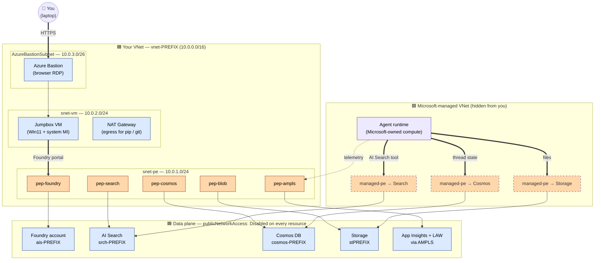
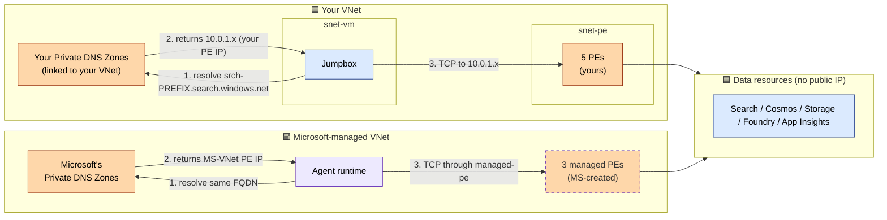
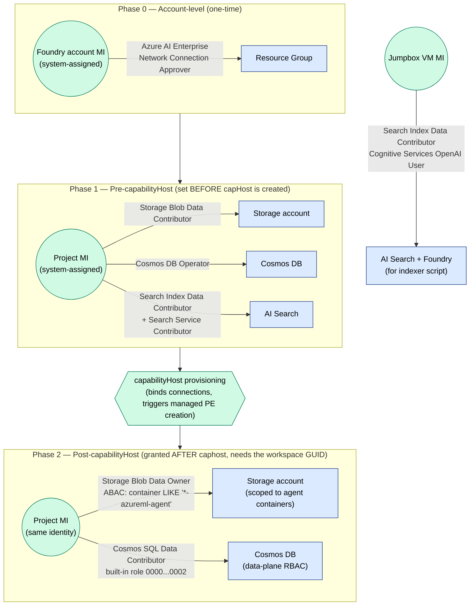
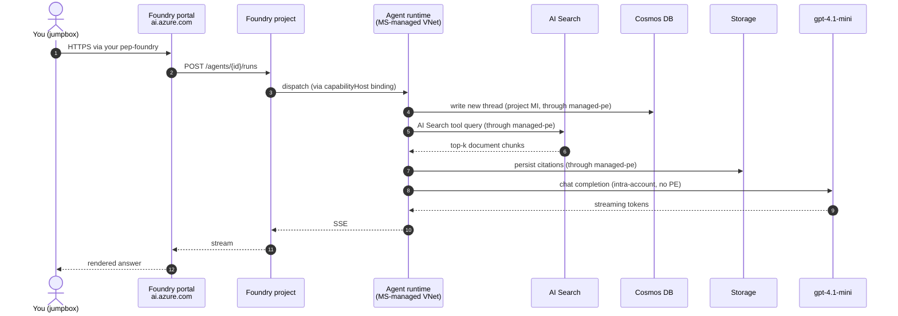

# Architecture Diagrams — Managed VNet flavor

Four diagrams, each answering one question. Read them top-to-bottom on first visit; jump straight to a specific one on follow-ups. All diagrams use the same colour legend so concepts stay recognisable across views.

## Colour legend

| Colour | Meaning |
|---|---|
| 🟦 Blue | **Your** VNet, subnets, resources, identities |
| 🟪 Purple | **Microsoft-managed** components — the hidden VNet that hosts the agent runtime and its auto-created PEs |
| 🟧 Orange | **Private Endpoint / DNS** — solid border = yours, dashed border = Microsoft-created |
| 🟩 Green | **Identity / RBAC** — managed identities and role assignments |

There is **no grey path** — the entire architecture is private. If you ever see a "public internet" arrow, that's a bug.

---

## 1. Solution context — what did we deploy and why?

The big picture. Two VNets are involved: yours (everything you can see) and a hidden Microsoft-managed VNet that hosts the agent runtime. Each VNet has its **own** PE to each backend — that's the dual-PE design that lets `publicNetworkAccess=Disabled` work for both you and the runtime.

**Three things to notice:**

1. **Two VNets** are involved. You only see and own the blue one. The purple one is provisioned and operated by Microsoft as part of the Foundry account.
2. **Two PEs to each backend** — your `pep-*` (solid orange) and Microsoft's `managed-pe` (dashed orange). They are physically separate Azure resources, in different VNets, but they point to the same target.
3. The `capabilityHost` resource is what triggers Microsoft to create the dashed PEs. Without it, the agent runtime has no path to your backends and every tool call fails with *"Invalid endpoint or connection failed"*.

---

## 2. Network topology — where does every packet go?

Same components, drawn to make the **DNS resolution path** explicit. The key insight: there are **two DNS resolution contexts** here — yours and Microsoft's. They independently resolve the same FQDN to different PE IPs.

**Debugging tip — when something fails, identify which path is broken:**

| Symptom | Likely path | Check |
|---|---|---|
| You can't open `https://ais-…` from jumpbox | Your DNS / your PE | `nslookup` should return `10.0.1.x` |
| Agent fails with *"Invalid endpoint or connection failed"* | Microsoft path | `capabilityHost` missing or managed PEs not approved |
| Indexer script works from jumpbox, agent run-time fails | The two paths diverged | Run `az network private-endpoint list -g $RG` (yours only) — managed ones aren't visible here, check the Managed VNet outbound rules instead |

---

## 3. Identity & RBAC chain — who is allowed to do what, in what order?

Identical structure to the BYO flavor — the data layer is the same. The one extra role here is the **account-level network connection approver**, which lets the Foundry account auto-approve the managed PEs Microsoft creates on your behalf.

**Why two phases?**

- **Phase 0 (account-level)** is unique to the Managed VNet flavor. The Foundry account creates managed PEs into your subscription during caphost provisioning; without this role, those PEs land in `Pending` state and the deployment hangs.
- **Phase 1 roles** must exist *before* `capabilityHost` is provisioned — Foundry validates that the project MI can read the BYO resources during caphost bootstrap.
- **Phase 2 roles** can only be granted *after* caphost completes — they reference the project's *workspace GUID*, which only comes into existence as a side effect of caphost provisioning. The ABAC condition on Storage scopes the project to its own containers (`<workspaceGuid>*-azureml-agent`).

---

## 4. Request flow — what happens between prompt and answer?

A timeline view of one user message. The key difference vs the BYO flavor: every step from `Runtime` outward traverses a **managed PE** (Microsoft-owned), not your PE.

**Where things typically break:**

| Step | Failure | Root cause |
|---|---|---|
| 1 | `nslookup` returns public IP | `privatelink.cognitiveservices.azure.com` zone not linked to your VNet |
| 3 | "Invalid endpoint or connection failed" | `capabilityHost` missing, or its managed PEs stuck in `Pending` (account MI missing the approver role from Phase 0) |
| 4 | 403 from Cosmos | Phase 2 RBAC missing (Cosmos SQL Data Contributor) |
| 5 | 403 from Search | Phase 1 RBAC missing (Search Index Data Contributor on project MI) |
| 8 | model timeout | model quota / deployment SKU mismatch — *not* a network issue |

---

## Where these diagrams live (and how to keep them in sync)

- **Source of truth:** this file (`docs/diagrams.md`). All mermaid blocks render natively on GitHub — no images to maintain.
- The repo `README.md` embeds **diagram #1** inline and links here for #2–#4 so a quick reader gets the gist without scrolling through four diagrams.
- If you change the topology (new subnet, new PE, new connection), update **only this file**. The README link still works.
- The BYO VNet flavor has a parallel `docs/diagrams.md` with the same 4 diagrams — placing them side by side is the fastest way to grok the difference between the two flavors.
